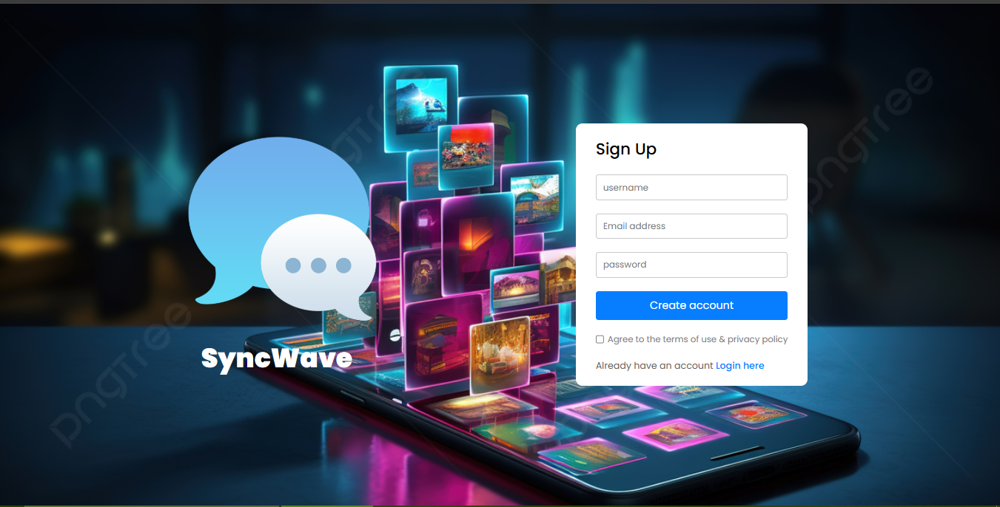
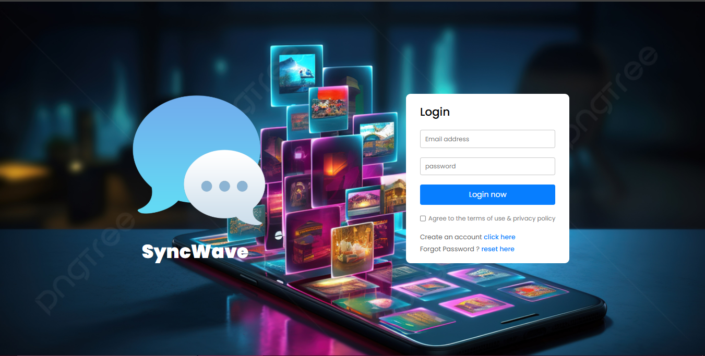
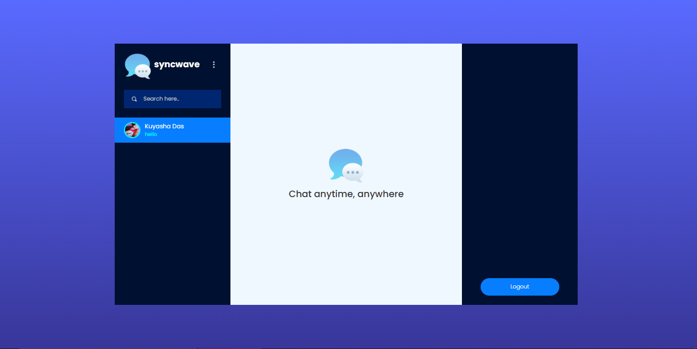
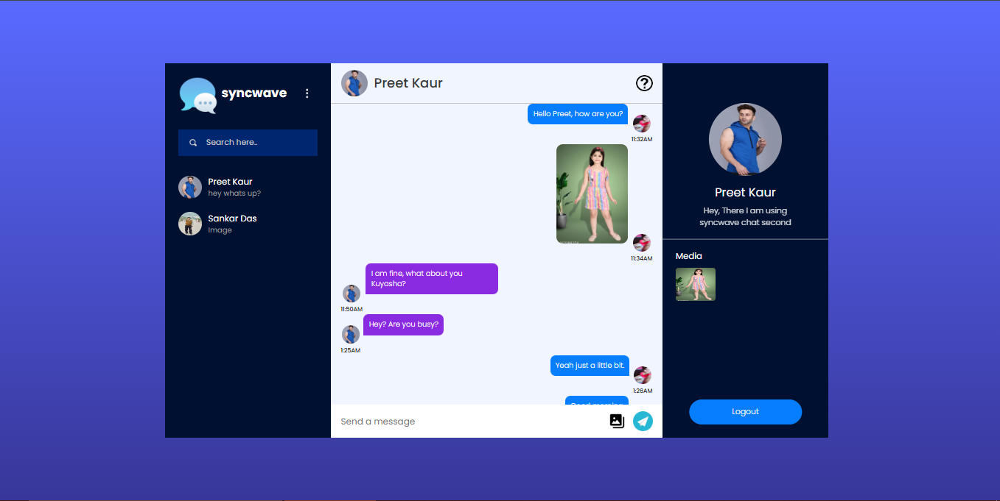
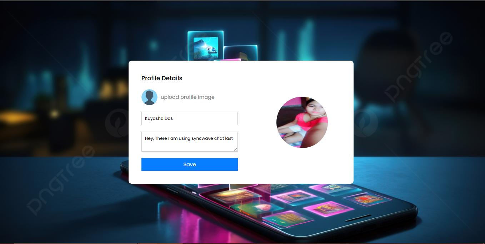

# SyncWave | A Realtime Chat Application

Built a responsive real-time chat application with Firebase authentication, image sharing, and presence indicators. Implemented React Hooks and Context API for efficient state management and global user/session handling. Firebase Firestore enables real-time messaging using onSnapshot .

---
## Live Demo
[Click here to view the live app](https://syncwave-two.vercel.app)  

---
## Tech Stack :

- Frontend : React.js(Hooks+Context API), , JavaScript, HTML5, CSS3
- Backend/Services : Firebase (Firestore, Auth, Hosting), Firebase Security Rules
- Other Tools : Git, GitHub, VS Code, Vercel(deployment)

---
## Description:

I designed and developed a full-featured real-time chat application using React.js and Firebase, focused on seamless user experience, authentication, and efficient message handling. This project was built to demonstrate my skills in full-stack web development, particularly real-time communication, state management, and cloud-based backend integration.

The app enables users to sign up and log in using Firebase Authentication, send and receive real-time messages via Cloud Firestore, and view the online/offline status of other users. In the chat users can also send the images and store the chat images in Cloudinary storage. The application features a clean and responsive UI, optimized for both desktop and mobile users.

Firebase’s real-time database and hosting made it possible to manage dynamic content with minimal latency. I used React Hooks and Context API for state management, and Firebase Security Rules to ensure secure access to user data and messages.

---
## Key Features:

- Authentication : 
Implemented user authentication(login and logout) using Firebase Auth. Firebase takes care of secure token management and session persistence. I used React Context to store the authenticated user's data and protected routes using onAuthStateChanged to ensure only loggedIn users can access the chat interface.

- Real-Time Messaging :
Messages are synced instantly across devices using Firestore’s real-time database. For instant update across users I have used Firestore's onSnapshot. Also messages are fetched in reverse order so that the newest messages appear at the bottom. For unseen messages, the profile image of sender is bordered and the last unseen message is highlighted.

- User Status and Presence :
Implemented user presence using a lastSeen timestamp. I have updated the user's lastSeen field in Firestore using their authenticated(auth.chatUser) at every 60 secs. This way I can check if a user was active recently(within last 70secs) to determine if the user is online. If the user's lastSeen is older than that , I consider the user is offline.This approach works well for basic presence tracking without needing firebase realtime database.

- Responsive UI/UX:
Built using CSS Flexbox/Grid and media queries to support all screen sizes.
user avatars, and timestamps for better usability.

- Security & Performance:
Firestore security rules implemented to restrict unauthorized access.
Minimal re-renders and optimized Firebase queries for improved performance.

- Hosting:
Deployed on Firebase Hosting or Vercel with fast load times and free SSL.

## Screenshots

1)Sign Up Page

2)Login Page

3)Chat Page1

4)Chat Page2

4)Profile Update Page

---
## Project Outcome & Learning:

This project helped me deepen my understanding of real-time data flow, component-based UI development in React, and backend-as-a-service (BaaS) solutions. It gave me hands-on experience in building scalable, secure, and modern web applications without needing to set up a traditional backend server.

I also gained valuable practice in responsive design, authentication logic, and cloud deployment—skills that are directly applicable to real-world full-stack web development roles.

---
## License
This project is open-source and available under the MIT License.

---
  

